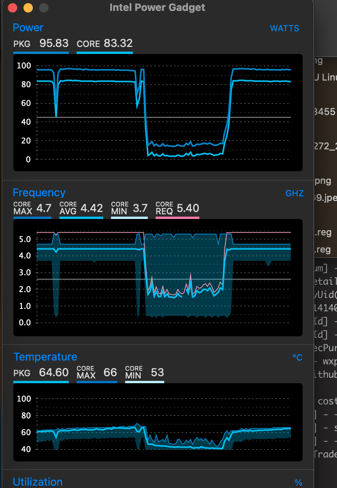

# Q1HY-13900HES

### 系统版本 Ventura 13.6.8 (OopenCore 1.0.1)
##### 得知sonoma博通网卡驱动问题,不折腾,我后端开发选择Ventura就行了

```
CPU Q1HY
主板 板U一体DDR4
散热 冰曼6热管双塔单风扇
内存 添百势DDR4 3600MH 16G * 2
显卡 RX5500XT8G
网卡 博通BCM94360
SSD A2000 500GB
机箱 真箱牛牛Z66
电源 鑫谷全模组550W
```

##### 折腾了一周左右,说一下遇到的问题和解决方案
##### 收到主板是一个上过螺丝的,估计这个板子退货很多.我也无所谓了.点亮刷了Leo的bios拉了一下频率, 1.2~1.3v 能上到 5.5 5.2 4.2,考虑入坑比较晚了,就不纠结体质问题了.我也不打算超太多使用.黑苹果调到了ac65 p核-165 5.4 4.7 3.8 长期使用,r23温度在70度左右. 功耗仪显示180w,待机60w左右. windows下待机功耗低点50w左右

- 问题1 CPU顶盖硅脂影响散热
  -  刚开始我以为本来是这个顶盖导热问题,CPU单考几十秒就撞温度墙,其中1,3,5核心温度高出近20度,我怎么调节螺丝都没用.我摸着顶盖也不是很烫.后面得知可以用相变片改善,用了霍尼韦尔7950片果然效果明显.个别核心温度高的问题也没了.整体温度也下降20度左右,可以全核心5.2G不超过90度.

- 问题2 电流墙
  -  Leo大佬的bios虽然解锁了电流墙,但是睡眠唤醒后电流墙又回来了,并且睡眠唤醒后我在使用中出现了全核锁屏率的400m问题, 需要重启.windows和mac系统都有重现. 这个板子不适合睡眠使用.

- 问题3 电流声
  -  我这个感觉声音还挺大的.超过了800转的风扇声音.不知道是不是个例.无解吧.

- 问题4 默认bios锁CFGLock
  -  黑苹果必须刷Leo的bios不然CFGLock,其他bios没尝试过.

- 问题5 显卡和电源安装
  - 这个机箱支持sfx电源和255CM的显卡,而我是ATX电源和259CM显卡.
  - ATX的电源安装被开关和螺丝孔位挡住,我只好将开关和螺丝柱敲掉,把之前的sfx的电源支架也拆了.塞入电源.这中间和显卡缝隙基本都是卡着用力压进去的.所以电源虽然没打螺丝固定.但是已经没用空隙了.用显卡支架顶住还挺稳的.电源开关就只能裸漏在外面了. 
  - 显卡安装时把前面板的螺丝拆了一颗,掰开一点才将显卡放入.显卡下面是用胶垫顶住.尽量保持水平. 安装时没拍照,当时我也不确定能行.只能看成品了效果了.
  - 模组线 24pin 和显卡 8pin 换了 20cm 的短线,之前的长线太占空间了

### 待补充图片


### 测试性能
- CPU 我尝试超频到p全核5.3, e全核4.2,电压要提高到1.35v, 1.12v温度90度,R23多核心25000左右,功耗表260w,能耗比差了不少.可以在需求高性能的情况下超.
- 我摸到的甜点电压温度频率是ac65 -165 双核5.4,4核5.1,全核4.7,小核全核3.8. 这样电压最高1.26v,满载全核1.06v,温度最高在70度以内(夏天空调房),很安静凉快.此时R23多核心22000分,功耗表180w内.
- 内存我尝试几个牌子,均没点亮到3600.添百势3600我4000直接点亮了,时序调了一下18-22-22-40电压1.35. SA复写1027现在跑着没啥问题.因为这个板子重置bios后要重启3次很麻烦,懒得细调了.

### bios配置


### 电源功率


### 相关测试结果


### mac系统


